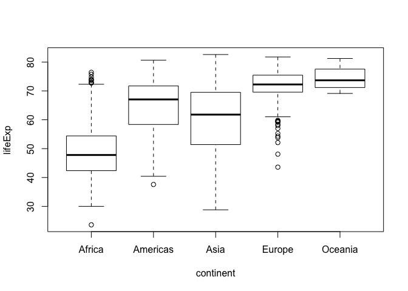

# R Markdown

###Summary of the Gapminder data **for fun**

            country        continent        year         lifeExp           pop              gdpPercap      
---  -----------------  -------------  -------------  --------------  ------------------  -----------------
     Afghanistan:  12   Africa  :624   Min.   :1952   Min.   :23.60   Min.   :6.001e+04   Min.   :   241.2 
     Albania    :  12   Americas:300   1st Qu.:1966   1st Qu.:48.20   1st Qu.:2.794e+06   1st Qu.:  1202.1 
     Algeria    :  12   Asia    :396   Median :1980   Median :60.71   Median :7.024e+06   Median :  3531.8 
     Angola     :  12   Europe  :360   Mean   :1980   Mean   :59.47   Mean   :2.960e+07   Mean   :  7215.3 
     Argentina  :  12   Oceania : 24   3rd Qu.:1993   3rd Qu.:70.85   3rd Qu.:1.959e+07   3rd Qu.:  9325.5 
     Australia  :  12   NA             Max.   :2007   Max.   :82.60   Max.   :1.319e+09   Max.   :113523.1 
     (Other)    :1632   NA             NA             NA              NA                  NA               

###Here is a *cool* plot:

<!-- -->

